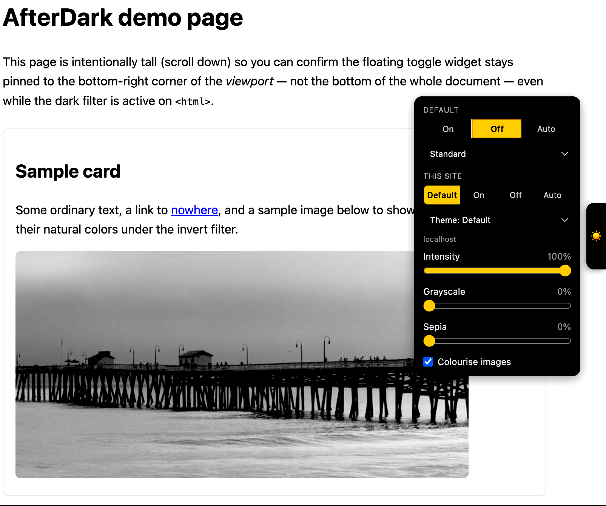
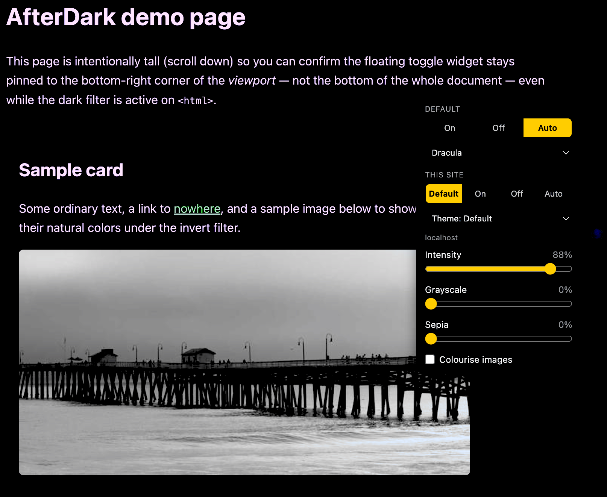

# AfterDark

A Tampermonkey userscript that darkens every site, similar to Dark Reader / Dark Night, using the CSS `invert()` + `hue-rotate()` technique (images/video/canvas are re-inverted so they keep natural colors).

| Light mode (off) | Dark mode (Dracula theme) |
| --- | --- |
|  |  |

## Install

1. Install [Tampermonkey](https://www.tampermonkey.net/) in your browser.
2. Open the Tampermonkey dashboard → **Utilities** (or **+**) → **Create a new script**.
3. Delete the placeholder content and paste in the contents of [`afterdark.user.js`](afterdark.user.js).
4. Save (`Ctrl/Cmd+S`). It runs on every site (`@match *://*/*`).

## Features

1. **Default toggle: On / Off / Auto** — the global fallback. "Auto" follows the OS/browser `prefers-color-scheme`, live-updating if you change your system theme.
2. **Per-site toggle: Default / On / Off / Auto** — independent of the global default. Stored per-hostname in Tampermonkey's script storage (`GM_setValue`/`GM_getValue`), not a cookie, so it isn't cleared when you clear site data and it's shared across tabs. "Default" (the default per-site option) means "fall back to the global toggle."
3. Per-site uses the **same three modes** as the default toggle (On/Off/Auto), plus "Default" to explicitly inherit.
4. **Theme presets**, selectable both as a global default and as an independent per-site override (same "Default / preset" pattern as the mode toggle):
   - **Standard** — plain invert + hue-rotate.
   - **Dimmed** — softer/lower-contrast, easier on the eyes.
   - **Sepia** — warm dark tone.
   - **Contrast** — punchier, higher-contrast dark mode.
   - **Dracula**, **Nord**, **Gruvbox Dark**, **Solarized Dark**, **Tokyo Night** — filter-tinted *approximations* of these popular color schemes (hue-rotate/sepia/saturate nudged toward each palette's signature accent color). These are not literal hex reproductions: a universal filter has no way to know what CSS variables any given site uses, unlike a site-specific userstyle that overrides known variables with exact colors (see [`../Action1-themes`](../Action1-themes) for an example of that approach, built for Action1's console specifically).

   Whichever theme is active, images/video/canvas are still corrected back to natural color first — the theme's extra brightness/contrast/sepia/hue adjustment then applies on top of that correction, so pictures subtly pick up the theme's mood instead of looking untouched or fully re-colored.
5. **Intensity / Grayscale / Sepia sliders** (global, in the panel, 0–100% each):
   - **Intensity** controls the depth and darkness of the theme without crushing contrast:
     - **0%** disables the theme completely (page and media remain 100% normal/untouched).
     - **100%** applies the full theme depth with rich, authentic theme colors (avoiding harsh pitch-black backgrounds and blinding stark-white text).
     - **Between 1% and 99%** smoothly scales the darkness and warmth of the theme, softening the background while always keeping text high-contrast and readable (never collapsing into uniform flat gray). Media elements are completely insulated from intensity adjustments.
   - **Grayscale** smoothly desaturates webpage elements, reaching a clean, distraction-free monochrome dark mode at 100% while keeping text contrast crisp.
   - **Sepia** adds a soothing, warm amber reading tone (cutting harsh blue light) that scales smoothly up to a rich, paper-like reading theme without turning the page into unreadable brown mud.
   - **Media Protection**: When "Colourise media" is off, images and videos remain in their natural colors and are completely insulated from Grayscale, Sepia, and Intensity slider adjustments.
6. **"Colourise media" checkbox** (global, in the panel) — unchecked (default): media (images, video, canvas, etc.) renders in natural, original colors without being altered by themes or sliders. Checked: media only cancels the base dark-mode flip, subtly adopting the active theme's and sliders' mood like the rest of the page.

   This works via an affine color-matrix engine: filter operations are composed in RGB space and applied to media through an SVG `feColorMatrix` filter kept in sync on every change. Singular projections are safely insulated so media never collapses into distorted sludge or flat gray.

## Controls

- **Floating tab** (flush against the right edge, vertically centered): click it to open a panel with segmented controls for mode ("Default" and "This site"), a theme dropdown under each, the three sliders, and the "Colourise media" checkbox — change any of them instantly.
- **Tampermonkey menu**: right-click the Tampermonkey toolbar icon → "AfterDark: cycle default (...)", "cycle this site (...)", "cycle default theme (...)", "cycle this site theme (...)", and "colourise media (...)" — each click advances to the next option (or toggles), handy if you don't want the on-page widget. The sliders are continuous, so they're widget-only (no menu entries).

## Notes / limitations

- The floating widget renders via the [Popover API](https://developer.mozilla.org/en-US/docs/Web/API/Popover_API) top layer (Chrome/Edge 114+, Safari 17+, Firefox 125+) so it's immune to the page's own dark filter and stays pinned to the viewport corner instead of scrolling away. On older browsers without Popover support it falls back to a plain fixed element, which can very rarely drift if a very tall page is also being darkened.

- The invert+hue-rotate trick is the same lightweight approach used by simple dark-mode extensions — it's fast and universal but, unlike Dark Reader's per-element color analysis, it won't intelligently re-theme CSS `background-image`s (only ``, `<video>`, `<canvas>`, `<iframe>`, `<embed>`, `<object>`, and inline `<svg><image>` are corrected).
- Settings are stored per-script via Tampermonkey (`GM_setValue`), scoped to the script, not per-cookie — they persist across all sites and sync across open tabs automatically.
- The widget only renders in the top-level frame (not inside embedded iframes), but the dark filter itself is applied inside iframes too so embedded content still darkens.
